# ATLAS Algorithm and Repository Roadmap

This document is the technical map of the ATLAS indoor patrol system. It is
intended for a developer who is new to the repository and needs to understand:

- which files contain the important algorithms;
- how a DJI frame becomes a room-frame pose and then a flight command;
- which state is authoritative at each stage;
- how the offline map, recorded patrol data, and live flight differ; and
- where the project should be improved without regressing the working path.

For the current machine setup, active assets, and handoff status, also read
[`DAVID_HANDOFF.md`](DAVID_HANDOFF.md). This document describes the durable
architecture rather than one particular experiment.

## 1. System in one page

ATLAS performs indoor navigation without GPS. A fixed room map is built with
COLMAP and SIFT. During a live flight, DJI camera frames are localized against
that map. Optical flow carries known 2D-to-3D correspondences between expensive
global registrations. TSolve/FARES solves the resulting PnP problem. The result
is transformed into an explicit room coordinate frame, checked for geometric,
temporal, and route consistency, and only then exposed to the guarded patrol
controller.

Recorded patrol images add two recovery aids:

- a fast ORB route-anchor matcher that estimates where the image belongs along
  the taught route; and
- a SIFT recovery bank whose descriptors remain associated with COLMAP 3D
  points and can therefore produce a metric PnP pose.

The ORB layer is **not ORB-SLAM**. It does not maintain a SLAM graph, keyframes,
loop closure, or visual-inertial odometry. COLMAP remains the persistent metric
map, and TSolve/FARES remains the principal PnP pose solver.

```mermaid
flowchart LR
    A[Offline room video] --> B[COLMAP + SIFT map]
    B --> C[Fixed 3D points, descriptors, cameras]
    D[DJI frame + capture time] --> E{Tracking source}
    C --> E
    E -->|global or recovery| F[2D-to-3D correspondences]
    E -->|LK optical flow| F
    G[Recorded route banks] --> E
    F --> H[TSolve / FARES PnP]
    H --> I[Raw world-to-camera R,t]
    I --> J[Room transform + route/time/jump gates]
    J --> K[Accepted and published pose]
    K --> L[Guarded patrol state machine]
    L -->|yaw / forward / hover| M[DJI bridge]
    M --> D
```



The most important safety rule is:

> A computed pose is only a candidate. It cannot drive the drone until it is
> current, accepted, transformed into the room frame, consistent with the
> active route state, and newer than the movement command being verified.

## 2. Runtime data flow

### 2.1 Offline map construction

1. Extract overlapping images from the room video.
2. Use COLMAP/SIFT to estimate map cameras and sparse 3D points.
3. Validate that the selected sparse component is internally consistent.
4. Export the map and its explicit room alignment to the ATLAS map library.
5. Optionally add points while preserving trusted reference camera poses.

The mapping video may come from an iPhone, but the live query images come from
the DJI camera. Therefore, the live PnP case must use the calibrated intrinsics
for the **DJI query image at its actual processed resolution**. The iPhone map
camera matrix is not a valid replacement.

### 2.2 Live localization

1. The DJI bridge decodes a video frame and records its source/capture/receive
   timing.
2. If a trusted 2D-to-3D pool exists, pyramidal Lucas-Kanade optical flow tracks
   its image points into the new frame. Forward-backward error and image bounds
   remove weak tracks.
3. If tracking is weak, stale, or inconsistent, the localizer requests recovery:
   direct fixed-map PnP, route-constrained ORB matching, taught SIFT recovery,
   or COLMAP image registration against a bounded reference subset.
4. Spatially distributed correspondences are written as a PnP case containing
   `K`, `p2d`, `p3d`, point IDs, and timing metadata.
5. TSolve/FARES computes candidate `R,t` values and scores them.
6. The localizer converts the result to a camera center, applies the room
   transform, and checks objective, step size, route corridor, monotonic route
   progress, command progress budget, turn state, and timestamp continuity.
7. A rejected candidate is recorded diagnostically but must not poison the last
   trusted tracking pool or published pose.

### 2.3 Guarded patrol control

The flight bridge owns the physical safety loop. The app can request a mission,
but the browser is never the authority for movement.

For each route leg, the bridge follows a guarded yaw-then-forward cycle:

1. obtain a fresh accepted pose;
2. rotate toward the active target while position is locked;
3. wait for post-command heading evidence;
4. send a short bounded forward command;
5. wait for a pose captured after that command;
6. verify displacement, route progress, cross-track error, and arrival evidence;
7. continue, correct, hover for relocalization, or abort safely.

Route recovery may reconcile a delayed estimator with the active leg, but it
cannot by itself prove physical movement or waypoint arrival.

## 3. Coordinate, camera, and time contracts

These contracts are cross-cutting. Violating one can make every individual
algorithm look correct while the complete patrol is wrong.

### Pose convention

COLMAP and TSolve expose a world-to-camera transform:

```text
x_camera = R * x_world + t
camera_center_world = -transpose(R) * t
```

Do not treat `t` as the camera position. Navigation uses the transformed camera
center.

### Room frame

- The room transform is explicit map metadata; it is not inferred again on each
  run.
- Room `X/Z` form the horizontal navigation plane.
- Room `Y` is flight altitude.
- Heading is derived from the camera forward direction after the room transform.
- During a proven rotation-only command, heading may change but position must
  remain locked.

### Camera intrinsics

- `K` belongs to the query camera, not the mapping camera.
- Its focal lengths and principal point must correspond to the actual image
  dimensions passed to feature extraction and PnP.
- Any resize/crop must update `K` with the same transform.
- Optical-flow pixel displacement is converted to a yaw hint with the focal
  length from this query calibration; it is not a metric translation sensor.

### Time and command epochs

Capture time, video receive time, decode time, processing time, and publication
time are different values. Control evidence must be based on capture order and
must be newer than the command it confirms. A newly published result derived
from an old frame is still stale.

## 4. Core algorithmic files

### 4.1 Application and orchestration

| File | Responsibility | Main logic | Not responsible for |
| --- | --- | --- | --- |
| [`scripts/atlas_app_server.py`](../scripts/atlas_app_server.py) | HTTP API, map/patrol library, job lifecycle, process launch, mission request validation, UI state | `validated_guarded_patrol_mission`, `send_dji_flight_command`, `AtlasHandler` | Estimating pose or issuing low-level DJI velocity commands |
| [`viewer/app.js`](../viewer/app.js) | Presents maps, paths, live status, and mission controls | Loads generated map/pose/status assets and constructs API requests | Safety authority or estimator truth |
| [`viewer/index.html`](../viewer/index.html), [`viewer/style.css`](../viewer/style.css) | UI structure and appearance | ATLAS monitor and control layout | Localization and control decisions |

`atlas_app_server.py` is large because it currently hosts several product
features. Treat it as an orchestrator: new pose mathematics should live in the
localization modules, and new flight-safety decisions should live in the bridge.

### 4.2 Live frame ingestion and flight control

| File | Responsibility | Main algorithms |
| --- | --- | --- |
| [`scripts/atlas_dji_live_bridge.py`](../scripts/atlas_dji_live_bridge.py) | DJI/OpenDJI TCP bridge, JPEG/frame/timestamp writing, telemetry, detector execution, guarded movement | Pose ordering/freshness gate, stabilized-pose safety check, geofence, route-leg verification, yaw-then-forward state machine, waypoint and turn evidence, bounded mission execution |
| [`scripts/atlas_dji_command.py`](../scripts/atlas_dji_command.py) | Sends one diagnostic command through the bridge | Standalone command construction and response handling |

`atlas_dji_command.py` is useful for controlled diagnostics. It bypasses the
normal app mission workflow and must not become the default autonomous patrol
entry point.

### 4.3 Main live localizer

| File | Responsibility | Main algorithms |
| --- | --- | --- |
| [`scripts/run_bounded_tsolve_video_stream.py`](../scripts/run_bounded_tsolve_video_stream.py) | End-to-end live/replay localization loop | In-process OpenCV SIFT, direct all-map Faiss IVF retrieval, LK correspondence tracking, flow-derived yaw hint, rotation-only position stabilization, geometric match verification, TSolve calls, route/time/jump acceptance gates, trusted-state hold and recovery |
| [`scripts/run_live_tsolve_existing_map_stream.py`](../scripts/run_live_tsolve_existing_map_stream.py) | Lower-level existing-map localization and TSolve adapter | Reference camera selection by distance/heading, case export, `live_fast` solver profile, quality-triggered full fallback |

Important objects and functions in the main localizer:

- `track_pool`: tracks mapped image points with pyramidal LK and a
  forward-backward consistency check while preserving their 3D point IDs.
- `stable_case_indices` / `write_case_from_pool`: select a stable,
  image-spanning subset and serialize a solver case.
- `optical_flow_yaw_delta`: estimates a bounded adjacent-frame yaw hint from
  median horizontal flow and the calibrated focal length.
- `RotationOnlyPositionStabilizer`: allows orientation to update while holding
  the last trusted center during verified turn-only commands.
- `GlobalRelocalizer`: extracts the current query with OpenCV SIFT, converts it
  to COLMAP-compatible RootSIFT, searches the persistent Faiss index directly,
  and rejects geometrically invalid or discontinuous recovery results.
- `LivePatrolRouteGate`: checks route identity, active leg, corridor, progress,
  turn state, and command displacement budget before accepting a candidate.

The raw solver output, accepted localization state, published display pose, and
physical drone position are four different concepts. Keep them separate in
code and diagnostics.

### 4.4 Route-aware visual recovery

| File | Responsibility | Main algorithms |
| --- | --- | --- |
| [`scripts/patrol_visual_route_recovery.py`](../scripts/patrol_visual_route_recovery.py) | Builds/loads an ORB route-anchor bank and matches live frames to the active route neighborhood | ORB detection, Hamming KNN ratio test, homography RANSAC, spatial coverage/scale/reprojection checks, leg/progress/temporal windows, multi-hit acquisition, endpoint consensus, verified rewind |
| [`scripts/taught_patrol_recovery.py`](../scripts/taught_patrol_recovery.py) | Metric recovery using SIFT descriptors tied to known map points | L2 ratio matching, unique 2D-to-3D association, `solvePnPRansac`, pose continuity, multi-anchor consensus |
| [`scripts/build_multirun_patrol_visual_bank.py`](../scripts/build_multirun_patrol_visual_bank.py) | Adds independent recorded route segments to the ORB bank | Composite-plan loading, segment selection, bank extension |
| `scripts/build_*patrol*_bank.py`, `scripts/build_point1_endpoint_extension.py` | Targeted experimental bank builders | Add specific single-run, tail, or endpoint evidence without changing runtime matching |

The ORB bank stores route evidence: anchor descriptors, active leg, progress,
expected center/heading, source frame, and source run. A good ORB match can say
“this image resembles this part of the taught route.” It is not automatically a
new metric pose, and it must be reconciled with current motion and route state.

The SIFT taught bank is slower but stronger geometrically because its features
retain COLMAP 3D identities and can construct an actual PnP problem.

### 4.5 Route baseline construction

| File | Responsibility | Main algorithms |
| --- | --- | --- |
| [`scripts/process_manual_patrol_recording.py`](../scripts/process_manual_patrol_recording.py) | Prepares a manually flown patrol recording | Frame timing, local flow/yaw estimates, robust position summaries |
| [`scripts/build_route_constrained_patrol_baseline.py`](../scripts/build_route_constrained_patrol_baseline.py) | Associates continuous recorded frames with the four-leg route geometry | Motion-activity cleanup, forward-motion progress, fixed-center turn interpolation, translation interpolation, cruise-height estimation, compact leg samples |

The route baseline is an explicit association between recorded images and known
patrol geometry. It is useful training/recovery evidence, but it is not
independent localization ground truth and must not overwrite a contradictory
live metric pose merely to make the visualization look correct.

### 4.6 COLMAP map and correspondence pipeline

| File | Responsibility | Main algorithms |
| --- | --- | --- |
| [`scripts/extract_frames.py`](../scripts/extract_frames.py) | Converts source video into timestamped images | Rate-limited frame extraction and resize |
| [`scripts/run_colmap_map_only.py`](../scripts/run_colmap_map_only.py) | Builds the fixed sparse room map | COLMAP feature extraction, matching, mapping, largest-component selection |
| [`scripts/run_colmap_pipeline.py`](../scripts/run_colmap_pipeline.py) | Historical map-plus-query replay pipeline | Builds map and registers query images into it |
| [`scripts/colmap_io.py`](../scripts/colmap_io.py) | Reads COLMAP text/binary models | Camera/image/point parsing, quaternion-to-rotation conversion, camera-center calculation |
| [`scripts/export_tsolve_inputs_from_colmap.py`](../scripts/export_tsolve_inputs_from_colmap.py) | Converts registered query observations to TSolve cases | 2D-to-3D extraction, farthest-spread sampling, deterministic case hash |
| [`scripts/atlas_map_validation.py`](../scripts/atlas_map_validation.py) | Validates candidate map assets | Frame-bank report, sparse component report, model/frame consistency notes |
| [`scripts/build_viewer_data.py`](../scripts/build_viewer_data.py), [`scripts/build_map_only_viewer_data.py`](../scripts/build_map_only_viewer_data.py) | Exports browser assets | Point/camera/pose serialization |

Map enhancement utilities are intentionally separate from live localization:

- [`scripts/enhance_colmap_fixed_reference.py`](../scripts/enhance_colmap_fixed_reference.py)
  registers extra evidence while preserving the fixed reference model;
- [`scripts/merge_colmap_additive_points.py`](../scripts/merge_colmap_additive_points.py)
  merges additive point tracks;
- [`scripts/filter_colmap_temporal_chain.py`](../scripts/filter_colmap_temporal_chain.py)
  removes temporally inconsistent pose chains;
- [`scripts/validate_fixed_reference_enhancement.py`](../scripts/validate_fixed_reference_enhancement.py)
  compares coverage and pose stability; and
- [`scripts/select_reference_preserving_trusted_poses.py`](../scripts/select_reference_preserving_trusted_poses.py)
  keeps only trusted reference-preserving observations.

### 4.7 TSolve/FARES PnP stack

| File | Responsibility | Main algorithms |
| --- | --- | --- |
| [`vendor/tsolve/solver/pnp_solver.py`](../vendor/tsolve/solver/pnp_solver.py) | PnP problem formulation and pose recovery | 3D centering/scaling, normalized camera rays, quaternion polynomial equations, rotation recovery, optimal translation, objective scoring |
| [`vendor/tsolve/dropin_patch/harness/run_fares_static_c_persistent_batch.py`](../vendor/tsolve/dropin_patch/harness/run_fares_static_c_persistent_batch.py) | Active persistent fast solver runtime | Direct coefficient construction, cached/static action-matrix branch, eigensolve, root refinement, FARES scoring, pose-prior selection, timing |
| [`vendor/tsolve/dropin_patch/harness/fares_static_c_replay.py`](../vendor/tsolve/dropin_patch/harness/fares_static_c_replay.py) | Static-branch training/replay and proof support | Branch learning, action kernels, separating linear form, exact/replay helpers |
| [`vendor/tsolve/dropin_patch/yam_code/fares_direct_coeffs.c`](../vendor/tsolve/dropin_patch/yam_code/fares_direct_coeffs.c) | Compiled fast polynomial coefficient kernel | Refactored direct coefficient evaluation |
| [`vendor/tsolve/dropin_patch/yam_code/pnp_root_refine.c`](../vendor/tsolve/dropin_patch/yam_code/pnp_root_refine.c) | Compiled root refinement | Fast numerical candidate refinement |
| [`vendor/tsolve/solver/pnp_poly_solvers.py`](../vendor/tsolve/solver/pnp_poly_solvers.py) | Historical/reference root methods | SymPy/msolve-oriented polynomial solving |
| [`scripts/setup_tsolve_runtime.py`](../scripts/setup_tsolve_runtime.py) | Packages the runtime used by a run | Copies the selected solver bundle into run outputs |
| [`scripts/benchmark_tsolve_root_profiles.py`](../scripts/benchmark_tsolve_root_profiles.py) | Compares solver profiles | `full` versus `live_fast` correctness/timing |

The active online path is the persistent `dropin_patch` runtime, not the older
`base_yam_code` reference tree. Any solver optimization must preserve candidate
roots, selected pose, reprojection/objective quality, and fallback behavior—not
only reduce elapsed time.

### 4.8 Enemy detection and response

| File | Responsibility | Main algorithms |
| --- | --- | --- |
| [`scripts/train_enemy_yolo.py`](../scripts/train_enemy_yolo.py) | Trains the configured visual detector | Dataset/config validation and Ultralytics training wrapper |
| [`scripts/atlas_app_server.py`](../scripts/atlas_app_server.py) | Labeling, interpolation, dataset creation, range calibration | Label persistence, track interpolation, detector training jobs |
| [`scripts/atlas_dji_live_bridge.py`](../scripts/atlas_dji_live_bridge.py) | Live inference and guarded response | Target association/prediction, range estimate, geofenced pursuit/response |

Enemy response shares the live bridge and its safety envelope, but it is not a
source of patrol localization truth.

## 5. Persistent data contracts

| Artifact | Producer | Consumer | Essential contents |
| --- | --- | --- | --- |
| `query_frames/query_*.jpg`, `frames.csv` | DJI bridge or replay extractor | Localizer | Image name, source frame/time, receive time; preserve capture ordering |
| PnP case: `input.json`, `p2d.csv`, `p3d.csv` | Localizer/COLMAP exporter | TSolve runtime | Query `K`, matched 2D/3D points, point IDs, timing, method, optional prior |
| `poses_partial.json`, `poses.json` | Localizer/solver | Bridge, UI, audits | Raw and room-frame pose, center/heading, success, source, rejection/hold reasons, timestamps, route context |
| `reference_candidate.json` | Route baseline builder | Localizer, bridge, UI | Map/patrol IDs, four legs, checkpoints, source samples, geometry lock |
| ORB route bank `.npz` | Route bank builders | `PatrolVisualRouteRecovery` | Descriptors/xy, anchor IDs, leg/progress, expected center/heading, source run/frame |
| Taught SIFT bank `.npz` | Taught recovery builder | `TaughtPatrolRecovery` | SIFT descriptors, COLMAP point IDs/3D points, anchor metadata |
| `control_command.json` | App server | DJI bridge | Mission/command ID, patrol identity, action, limits and safety context |
| `control_status.json` | DJI bridge | App/UI/localizer | Current execution state, command epoch, active leg, telemetry, errors |
| `control_status_history.jsonl` | DJI bridge | Audits | Append-only command and state transitions |
| `viewer/public/maps/manifest.json` | App/map jobs | App/UI | Map library, room transform, replays, patrols, active assets |
| `live_stage_times.csv` | Live localizer | Performance analysis | Per-frame feature, tracking, registration, solver, gating and publication timing |

Files under `viewer/public/live_dji`, most of `viewer/public/maps`, `results`,
`runtime`, and `data` are mutable/generated assets. Do not manually edit them to
fix an algorithm. Change the producer and regenerate the artifact.

## 6. Runtime state that must remain separate

| State | Meaning | May update when |
| --- | --- | --- |
| Raw candidate | A solver or recovery module proposed a pose | A computation finishes, even if stale or wrong |
| Accepted pose | Candidate passed estimator gates | Objective, geometry, route, time, and continuity pass |
| Published pose | State exposed to bridge/UI | Accepted state is serialized in monotonic capture order |
| Tracking pool | 2D features currently tied to map 3D points | New tracking/relocalization evidence is accepted |
| Route progress | Controller/localizer belief about active leg and progress | Command and route evidence pass the route state machine |
| Physical state | Where the aircraft actually is | Only the aircraft changes it; delayed video cannot retroactively change it |

A common failure pattern is accepting a false jump into one of these states and
then using it as the prior for the next frame. The correct response to one bad
candidate is to keep the last trusted state, hover if control evidence is stale,
and relocalize. It is not to move the trusted state to make the route look
continuous.

## 7. Validation and regression tests

### Automated tests

| Area | Tests |
| --- | --- |
| Route recovery | `test_patrol_visual_route_recovery.py`, `test_taught_patrol_recovery.py`, `test_anchor_gap_tools.py` |
| Pose/room alignment | `test_live_room_alignment.py`, `test_viewer_pose_order.py`, `test_copy_map_alignment.py` |
| Flight safety and state machine | `test_patrol_safety.py`, `test_live_control_sections.py`, `test_enemy_lab_safety.py` |
| Route reference and imports | `test_route_constrained_patrol_baseline.py`, `test_patrol_import.py` |
| Live-run outcomes | `test_live_patrol_run_audit.py` |
| UI/offline rendering | `test_camera_path_*`, `test_map_mesh_overlay.py`, `test_uploaded_video_coverage.py` |

### Run-specific audits

- [`scripts/audit_live_patrol_runs.py`](../scripts/audit_live_patrol_runs.py):
  ordered checkpoint hits and maximum reached checkpoint.
- [`scripts/audit_patrol_pose_stream.py`](../scripts/audit_patrol_pose_stream.py):
  cross-track error, discontinuity, route progress, and endpoint drift.
- [`scripts/audit_patrol_visual_route_recovery.py`](../scripts/audit_patrol_visual_route_recovery.py):
  recovery quality under image transformations.
- [`scripts/audit_recorded_patrol_motion.py`](../scripts/audit_recorded_patrol_motion.py):
  optical motion and ORB evidence in recorded segments.
- [`scripts/validate_replay_consistency.py`](../scripts/validate_replay_consistency.py):
  accepted pose consistency across replay runs.
- `scripts/audit_*patrol*_bank.py` and
  `scripts/audit_point1_endpoint_extension.py`: targeted experimental bank
  coverage checks.

Recorded replay is necessary for deterministic regression testing, but it does
not prove live-flight success. Live acceptance also requires evidence that
capture time, processing time, commands, and physical motion stay synchronized.

## 8. Recommended developer reading order

1. [`DAVID_HANDOFF.md`](DAVID_HANDOFF.md) for the current branch and machine
   state.
2. This document for system boundaries and invariants.
3. `config.example.json` and the active `config.json` for runtime wiring.
4. `validated_guarded_patrol_mission` in `atlas_app_server.py` to see the app-to-
   bridge mission contract.
5. The main loop and the classes listed above in
   `run_bounded_tsolve_video_stream.py`.
6. `PatrolVisualRouteRecovery` and `TaughtPatrolRecovery` to understand the two
   different recovery meanings.
7. `ReferenceSelector` and `solve_case` in
   `run_live_tsolve_existing_map_stream.py`, then the persistent TSolve runtime.
8. `verified_route_follow_leg` and the guarded mission execution path in
   `atlas_dji_live_bridge.py`.
9. Safety tests and run audits before changing thresholds or state transitions.

## 9. Where a change belongs

| Desired change | Correct layer |
| --- | --- |
| Better map coverage or more stable 3D points | COLMAP map/enhancement scripts |
| Correct DJI focal length, distortion, crop, or resize | Query calibration and localizer case construction |
| Faster adjacent-frame continuity | LK tracking/localizer |
| Better recognition of a known patrol segment | ORB route bank/recovery |
| Metric recovery from recorded image features | Taught SIFT recovery/direct PnP |
| Faster PnP roots/eigensolve | Active persistent TSolve runtime, with solver equivalence tests |
| Pose acceptance, jump rejection, route corridor | Localizer gates |
| Hover/retry/turn/forward/arrival behavior | DJI bridge state machine |
| Map/path/status display | Viewer |
| Job launch, API, map library, mission request validation | App server |

Avoid solving a localization defect by changing the display path, or solving a
controller defect by forcing the estimator onto the taught line. Those changes
hide the evidence needed to diagnose the actual failure.

## 10. Current technical risk

The remaining patrol weakness is not simply “PnP cannot compute a pose.” The
system can produce good poses and has reached the later checkpoints in recorded
and live runs. The fragile part is maintaining one timely, internally consistent
state through turns and low/repetitive-texture legs—especially `3 -> 4` and
`4 -> 1`—while the physical drone, video pipeline, localizer, route recovery,
and controller advance at different times.

Observable failure modes include:

- optical-flow anchors disappear during a turn or against a blank/repetitive
  wall;
- a delayed or ambiguous registration proposes a forward/backward jump;
- the safe gate holds the model at the last trusted pose while the aircraft has
  already executed the previous bounded command;
- stale recovery is published late and interpreted as current evidence;
- route progress advances from visual prior without enough physical-motion
  evidence, or fails to advance despite real motion; and
- a growing backlog causes frame skipping, reducing continuity exactly where
  recovery needs adjacent observations.

Do not address this by globally lowering all thresholds. Each rejection reason
must be measured against capture/command timing and physical evidence first.

## 11. GitHub engineering roadmap

### Milestone A — Reproducible reference run

**Goal:** every developer can reproduce the same estimator result without the
drone.

- Pin a small representative map, query sequence, query calibration, patrol
  reference, route banks, and expected hashes/metrics.
- Provide one command for the deterministic replay and one for its audits.
- Record expected accepted/rejected pose counts, route progress, objectives,
  solver equivalence, and stage latency.
- Make all unit and integration tests pass from a documented environment.

**Exit criterion:** two clean checkouts produce equivalent accepted pose and
route-state timelines within documented numeric tolerances.

### Milestone B — One authoritative timeline

**Goal:** make delay and stale-state bugs directly observable.

- Give every frame, pose candidate, accepted pose, command, and controller state
  a monotonic ID plus capture, receive, process, and publish timestamps.
- Record the command epoch that each pose is allowed to confirm.
- Replace repeated whole-file reads/writes on the hot path with an append/delta
  stream or bounded journal while keeping a stable snapshot for the UI.
- Emit structured reason codes for every hold, rejection, recovery, and abort.
- Add a timeline audit that aligns video motion, solver output, published pose,
  and issued commands.

**Exit criterion:** a developer can identify the first causal event of a failed
run from logs without watching the UI.

### Milestone C — Deterministic continuous localization

**Goal:** preserve working `1 -> 2 -> 3` behavior while removing freezes on the
weak legs.

- Keep the last trusted correspondence pool immutable until replacement
  evidence passes all gates.
- Profile and bound LK, ORB, SIFT, COLMAP, and TSolve work independently.
- Cache immutable map descriptors and reference selection structures.
- Keep route-constrained ORB exact/fallback behavior covered by regression tests.
- Evaluate a localization-only VIO/SLAM tracker as an additional continuity
  source, anchored periodically to COLMAP/TSolve; do not silently replace the
  fixed metric map.

**Exit criterion:** the deterministic difficult-turn replay has no unexplained
published freeze/jump, and all earlier successful segments remain equivalent.

### Milestone D — Bounded online relocalization

**Goal:** recover promptly without accepting a false jump.

- Build a fast fixed-map descriptor/3D index for direct PnP recovery.
- Keep COLMAP fallback reference selection spatially and temporally bounded.
- Cancel or ignore background work whose frame/command epoch has expired.
- Require consensus for large correction and keep raw candidates visible.
- Formalize recovery acquisition, confirmation, rejection, and timeout states.

**Exit criterion:** injected tracking loss causes hover, bounded recovery, and
safe route continuation in the reference replay suite.

### Milestone E — Repeatable two-circle controller

**Goal:** complete the same physical route from small initial/path variations.

- Make the controller state machine explicit and serializable.
- Keep separate evidence for heading completion, forward displacement, waypoint
  arrival, overshoot, and lap transition.
- Support bounded correction, including a safe reverse correction only when
  current metric pose and clearance make it valid.
- Add a simulation with independent recordings for the two laps; do not create
  the second lap by merely duplicating published poses.
- Define physical safety limits independently of route matching confidence.

**Exit criterion:** ordered hits
`1-2-3-4-1-2-3-4-1`, no stale-pose movement, no geofence violation, and bounded
cross-track/latency on repeated live trials.

### Milestone F — Split modules without changing behavior

**Goal:** make ownership and review practical after behavior is covered.

- Split `atlas_app_server.py` into API, jobs, map library, patrol library, and
  enemy-lab packages.
- Split `run_bounded_tsolve_video_stream.py` into frame source, tracker,
  relocalizers, solver adapter, acceptance gate, and publisher.
- Split `atlas_dji_live_bridge.py` into transport, telemetry, command executor,
  patrol controller, and enemy response.
- Introduce versioned typed schemas for pose, route, command, status, and map
  metadata.
- Preserve command-line compatibility until integration tests cover the new
  package boundaries.

**Exit criterion:** core files have single responsibilities, schemas are
validated at boundaries, and replay/live safety tests remain unchanged.

## 12. Definition of a successful patrol release

A release is not accepted because the model draws two attractive circles. It is
accepted only when all of the following are demonstrated:

- localization can initialize from a documented range of positions in the room;
- the controller enters Point 1 safely, then completes two ordered physical
  circles;
- every movement command is supported by a fresh post-command pose;
- rotations do not introduce false translation;
- raw, rejected, held, accepted, and recovered poses remain available for audit;
- no safety/geofence violation occurs;
- the estimator stays within the documented latency and cross-track limits; and
- a deterministic recorded regression plus multiple live trials preserve the
  same algorithmic behavior.
